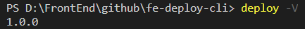
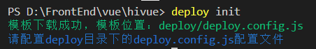
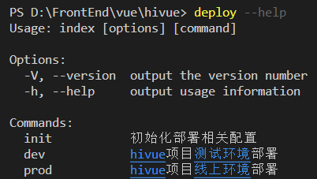
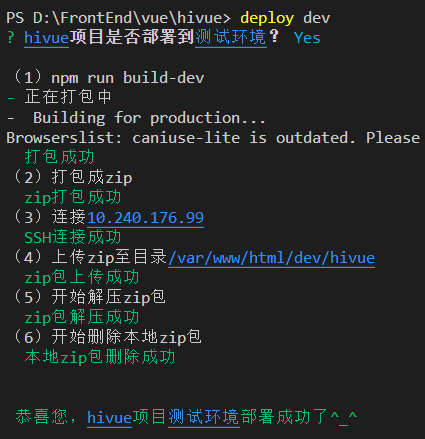
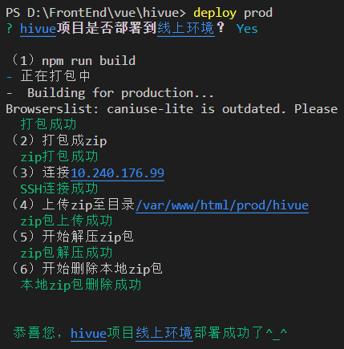

<!--
 * @Descripttion:
 * @version:
 * @Author: ZZF
 * @Date: 2020-06-11 15:28:36
 * @LastEditors: ZZF
 * @LastEditTime: 2020-06-11 17:38:57
-->

# fe-deploy-cli

前端轻量化部署脚手架，支持测试、线上等多环境部署，支持环境配置扩展，实现一条命令即可完成整个部署流程，同时支持将资源更新到 docker 中并重启 docker。

## git 地址：

## npm 地址：

## 博客

## 使用指南

https://github.com/dadaiwei/fe-deploy-cli/blob/master/README.md

## 前提条件

能通过 ssh 连上服务器

## 安装

全局安装 fe-deploy-cli

```
npm i fe-deploy-cli -g
```

查看版本，表示安装成功。



## 使用

### 1.初始化部署模板

```
deploy init
```



### 2.配置部署环境

部署配置文件位于 deploy 文件夹下的`deploy.config.js`, 一般包含`dev`（测试环境）和`prod`（线上环境）两个配置，再有多余的环境配置形式与之类似，只有一个环境的可以删除另一个多余的配置（比如只有`prod`线上环境，请删除`dev`测试环境配置）。

具体配置信息请参考配置文件注释：

```
module.exports = {
  privateKey: '', // 本地私钥地址，位置一般在C:/Users/xxx/.ssh/id_rsa，非必填，有私钥则配置
  passphrase: '', // 本地私钥密码，非必填，有私钥则配置
  projectName: 'xxx', // 项目名称
  dev: { // 测试环境

  },
  prod: {  // 线上环境

  }
  // 再还有多余的环境按照这个格式写即可
}
```

### 3.查看部署命令

配置好`prod.config.js`，运行

```
deploy --help
```

查看部署命令



### 4.测试环境部署

测试环境部署采用的时`dev`的配置

```
deploy dev
```



### 5.线上环境部署

线上环境部署采用的时`prod`的配置

```
deploy prod
```

部署流程和测试环境相同：



感谢支持，欢迎 star，O(∩_∩)O。
