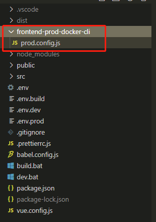
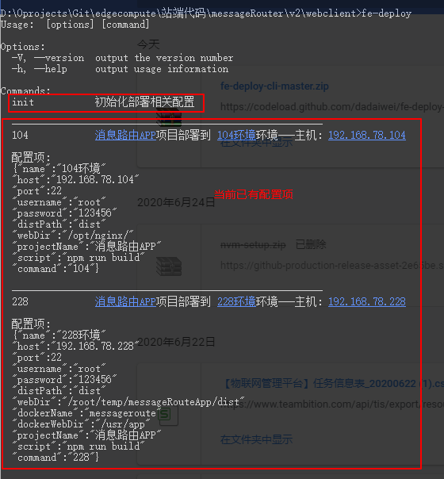

# frontend-prod-docker-cli

前端轻量化部署脚手架，支持测试、线上等多环境部署，支持环境配置扩展，实现一条命令即可完成整个部署流程，同时支持将资源更新到 docker 中并重启 docker;支持多套环境一键部署。

## github 地址：

https://github.com/Joseph244/frontend-prod-docker-cli

## npm 地址：

https://www.npmjs.com/package/frontend-prod-docker-cli

## 简介

前端或服务端开发传统的打包方式为，当开发完毕之后执行打包命令（前端一般为 npm run build，java 依赖 mavan 打包命令为 mvn package -Dmaven.test.skip=true，go 服务打包命令为 go build demo.go 等），之后打开 ssh 工具连接服务器，通过 ftp 或者 ssh 工具将打包之后的应用程序包上传到服务器某位置，然后重启或 reload；如果是 docker 打包，还需要 docker cp ... ...将文件 copy 到容器内，执行 docker restart ... ,docker commit container... ,docker push 等一系列命令。每次版本更新还都要执行上面的一系列操作，好麻烦。。。 。。。
这种固定流程化的工作为什么不能使用一个脚手架直接实现呢？
其实业界已经有很多的成熟方案，包括 gitlab + git hook + jenkins 等方案；但是相对小团队或者没有条件搭建这样一套比较重环境的团队,做这个事情又需要做太多的维护和搭建工作，在下受到 vue-cli 和很多前端脚手架的启发，开发了这个简陋的小工具，可以实现上述工作的部分流程化，采用一次配置，一行命令更新的方式，简化开发者的手工操作，欢迎大家使用和 issue，喜欢的话小手给个 star 激励一下，谢谢！

本脚手架使用的前提条件： 1.本地安装 node v10.0.0 以上； 2.能通过 ssh 连上您的服务器; 3.如只是前端和 node 端打包，无需其他环境；如果是 java 打包需要安装 jdk，jre，mavan；如果是 go 基础环境打包，需要安装和 go 基础环境。

** 注意：本脚手架目前只支持开发者更新服务时使用 **

## 当前 cli 功能清单

1.前端 spa 单页应用打包，服务器直接更新部署；支持 docker 更新；

2.node 服务端打包发布，服务器直接更新部署；支持 docker 更新；

3.多环境一起更新；fe-deploy all

## 作者博客

可关注掘金主页：https://juejin.im/post/5ee10b0ce51d4578853d3bee

## 安装

1.需要预先安装 node 版本为 9.0.0 以上;  
2.全局安装 frontend-prod-docker-cli

```
npm i frontend-prod-docker-cli -g

```

查看版本

```
fe-deploy -V
```

## 使用

### 1.初始化部署模板

会自动从仓库拉取默认配置文件，在当前目录下生成 frontend-prod-docker-cli 文件夹，文件夹内的 prod.config.js 即为对应配置文件，开发者按照说明自行填写

在当前项目目录下执行以下命令：

```
fe-deploy init
```

可看到在当前项目目录下生成了配置文件如下：


### 2.配置部署环境

部署配置文件位于当前项目下 frontend-prod-docker-cli 文件夹下的`prod.config.js`, 可包含多个环境配置，支持选择单个环境部署，也可多环境一键部署

具体配置信息请参考配置文件注释；
下面的 prod106 名可自由配置，自己起名（可以起为自己服务器 ip 末尾，命名不可出现特殊字符，不可以数字和特殊字符开头）

```
module.exports = {
	projectName: 'xxxx系统', // 项目名称
    script: 'npm run build', // 打包脚本（注释掉即不执行该命令，直接上传）

    // 根据需要进行配置，如prod106等（key命名不可出现特殊字符，不可以数字和特殊字符开头）
    // 上传服务器并采用docker方式部署重启配置案例
    prod106: {
        name: 'prod106环境',
        host: '192.168.78.106', // 服务器地址,其中xxx为手动输入ip末尾
        port: 22, // ssh port，一般默认22
        username: 'root', // 登录服务器用户名
        password: '', // 填写登录服务器密码
        distPath: 'dist', // 当前工程中需要上传服务器的文件夹（前不加斜杠标识相对当前工程目录，如加斜杠就需要写出本地完整绝对路径)
        webDir: '/root/temp/messageRouteApp', // 打包文件上传服务器地址(会将上一行配置的distPath文件夹上传到该位置)
        dockerName: 'messageroute', // docker名称
        dockerWebDir: '/usr/app' // 容器中文件存放位置
        // lastCmd: 'pm2 restart app' // 所有动作执行完之后在服务器上执行的自定义命令（可不配置）
    },
	// 再还有多余的环境按照类似prod106格式继续填写即可
}
```

### 3.环境部署

配置好`prod.config.js`，运行

```
fe-deploy           // 可以看到自己的部署命令和配置文件内容
fe-deploy  prod106  // 直接执行prod106环境部署（fe-deploy xxx (xxx 为 prod.config.js 中配置环境的键值，如上面的“prod106”)）

```




#### 多环境部署

可以将配置文件配置好的多个环境，手动勾选，一次部署，命令为：

```
fe-deploy  all      // 在所有配置环境中选择多个环境一键部署多环境
```

本系统初期参考https://github.com/dadaiwei/fe-deploy-cli，并借鉴vue-cli思路是实现，在此感谢！

欢迎大家支持，还会不断更新支持更多功能，如有改进意见请多读指教，欢迎 star 一下子！
